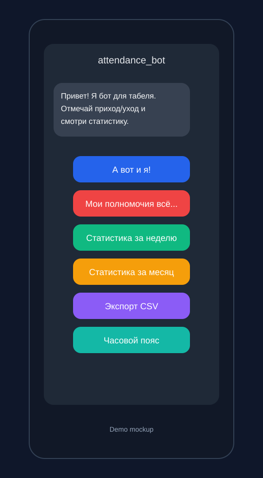
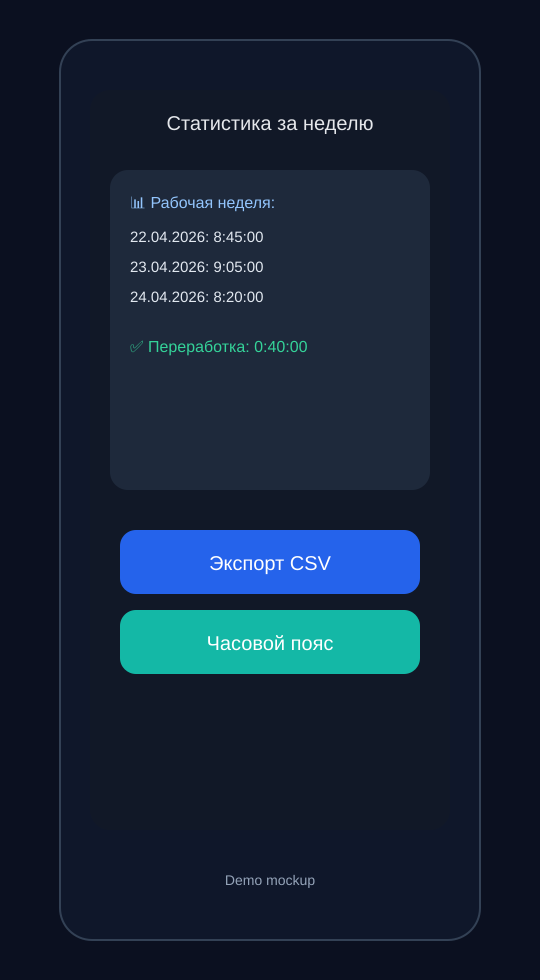
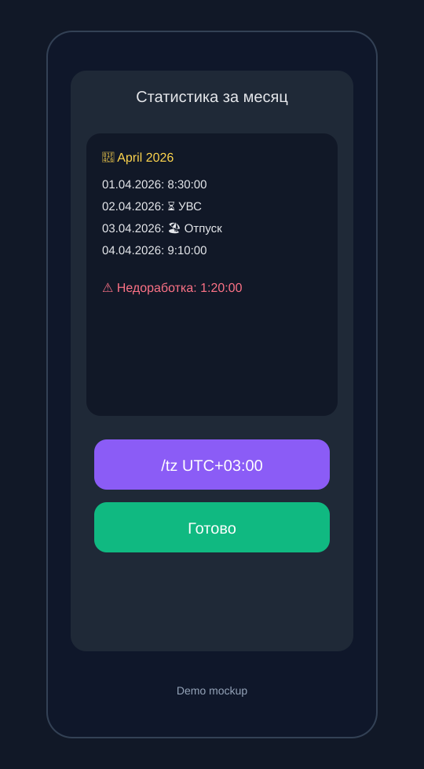

# attendance_bot

Telegram bot for personal attendance and work-time tracking.

## Problem
Manual attendance tracking is noisy and error-prone. `attendance_bot` gives a lightweight Telegram interface to:
- mark arrival/departure
- save special day statuses (vacation, leave, shortened day)
- calculate weekly/monthly balance automatically

## Stack
- Python 3.10+
- Aiogram 3
- SQLite
- environs

## Quick Start
```bash
git clone https://github.com/xelvhk/attendance_bot.git
cd attendance_bot
python -m venv .venv
source .venv/bin/activate
pip install -r requirements.txt
cp .env.example .env
python main.py
```

## Environment
Create `.env` from `.env.example`:
```env
BOT_TOKEN=your_telegram_bot_token
```

## Architecture
- `main.py`: app bootstrap, bot/dispatcher startup
- `handlers/`: Telegram commands and message handlers
- `services/`: domain logic (attendance, stats, db)
- `services/user_timezone_service.py`: per-user timezone storage and parsing
- `config_data/`: config loading from env
- `keyboards/`, `lexicon/`: UI and localized texts

## Demo / Screenshots
- Demo chat flow (mockup previews):





- Note: these are UI mockup previews to document bot scenarios.
- Timezone setup flow: `/tz +3` or `/tz UTC+03:00`

## Group support
- The bot keeps attendance per chat, so personal and group data are separated.
- Add the bot to a group and run `/setup_chat`.
- Until `/setup_chat` is executed, group attendance commands stay disabled.
- Useful group commands: `/in`, `/out`, `/mk`, `/uvc`, `/uvs 6`, `/short_day 7`, `/vacation`, `/personal_day`
- Statistics commands: `/week`, `/month`, `/balance`, `/all_stats`, `/manual 2024-12-31 09:00:00-18:00:00`
- Admin commands: `/chat_info`, `/chat_admins`, `/add_admin` in reply or `/add_admin <user_id>`, `/remove_admin` in reply or `/remove_admin <user_id>`, `/disable_chat`

## QA / Edge Cases
- Timezone and status transition checklist: [`docs/TIMEZONE_STATUS_EDGE_CASES.md`](./docs/TIMEZONE_STATUS_EDGE_CASES.md)

## Roadmap
- [x] Export monthly/all records to CSV (via `Экспорт CSV` button)
- [x] Add per-user timezone setting (`/tz +3`, `/tz UTC+03:00`)
- [ ] Add simple admin command for data backup
- [x] Add unit tests for `services/stats_service.py`

## CI
Minimal CI is configured in `.github/workflows/ci.yml`:
- install dependencies
- run syntax check (`python -m compileall`)
- run unit tests (`python -m unittest discover -s tests`)

## Error Logging Policy
- Keep `logging` enabled at `INFO` in production and `DEBUG` only for local troubleshooting.
- Log startup, command handling, and storage errors with context (`user_id`, handler name).
- Never log secrets (`BOT_TOKEN`) or full sensitive payloads.
- For unexpected exceptions in handlers, return a friendly user message and log traceback for diagnostics.
